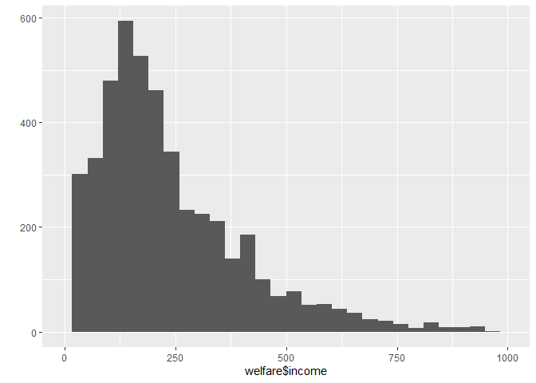

성별에 따라 월급이 다를까
================
작성자
July 30, 2020

## 2\. 성별에 따른 월급 차이

### 분석 절차

### 성별 변수 검토 및 전처리

전처리는 데이터를 가공하는 것을 의미합니다.

#### 1\. 변수 검토하기

  - 성별 변수의 타입을 파악하고, 각 범주에 몇명이 있는지 알아보겠습니다. class()와 table()을 이용합니다.
    table()은 성별 변수가 범주 변수이기 때문에 각 범주의 빈도를 확인하면 특징을 파악할 수 있어 사용합니다.

<!-- end list -->

``` r
class(welfare$sex) # welfare의 sex 변수 타입 확인하기 
table(welfare$sex) # welfare의 sex 변수가 범주변수로 빈도표를 작성하여 변수 특징 확인하기 
```

welfare 데이터의 sex 변수는 실수형으로 이루어져있고, 남성이 7578명, 여성이 9086명임을 알 수있습니다.

이때, 1과 2의 뜻을 바로 이해할 수 있도록 변수 명을 수정하겠습니다.

  - 변수명 수정하기 변수명 수정은 ifelse()인 조건문을 이용하여 변경하도록 하겠습니다.

<!-- end list -->

``` r
welfare$sex <- ifelse(welfare$sex== 1, "male","female") # sex 변수값인 1을 남성으로, 2를 여성으로 수정하기 
table(welfare$sex)
```

    ## 
    ## female   male 
    ##   9086   7578

  - 그래프 그리기 간단하게 ggplot2 패키지에 있는 qplot 함수를 이용하겠습니다.

<!-- end list -->

``` r
qplot(welfare$sex) # sex 변수를 기준으로 빈도표 그리기 
```

<!-- -->

  - 성별 데이터의 이상치가 있는지, 없는지 확인해보겠습니다.

<!-- end list -->

``` r
table(welfare$sex) # welfare의 sex 변수 빈도표 작성하기
```

1과 2만 출력되는 것으로 보아 이상치는 없는 것으로 확인하였습니다.

#### 2\. 전처리

### 월급 변수 검토 및 전처리

#### 1\. 변수 검토하기

  - 월급은 ’일한 달의 월 평균’임금을 의미하며, 1만원 단위로 기록되어 있습니다. 월급변수는 연속변수이기 때문에 요약
    통계량인 summary()함수로 확인해야합니다.

<!-- end list -->

``` r
class(welfare$income) # income 변수의 타입 확인하기
```

    ## [1] "numeric"

``` r
summary(welfare$income) # income 변수가 연속변수이므로 요약 통계량으로 변수 특징 파악하기 
```

    ##    Min. 1st Qu.  Median    Mean 3rd Qu.    Max.    NA's 
    ##     0.0   122.0   192.5   241.6   316.6  2400.0   12030

  - 그래프 그리기 모든 값을 표현하기 보다는 0\~1000사이의 데이터를 확인하도록 하겠습니다. 동일하게 qplot()를
    이용하며, x 축 범위를 조정할 수 있는 xlim()을 조합하여 작성하겠습니다.

<!-- end list -->

``` r
qplot(welfare$income) + xlim(0,1000) # income 변수를 0-1000사이의 데이터만 포함하여 빈도표 그리기 
```

<!-- -->

#### 2\. 전처리

앞서 파악한 요약 통계량을 보면 결측치가 12030개가 있습니다. 직업이 없어서 월급을 받지 않는 응답자가 있기 때문에 결측치가
존재하는 것입니다. 따라서 월급 변수를 이용하는 분석을 할 경우 먼저 결측치를 제외해야 합니다.

코드북에는 월급이 1\~9998사이의 값을 지닌다고 되어 있는데 summary() 출력결과에 최솟값이 0으로 나타나있습니다. 이는
이상치가 촌재한다는 의미입니다.

1.  이상치 결측 처리 조건문을 활용하여 이상치의 값을 결측치로 변경하겠습니다.

<!-- end list -->

``` r
welfare$income <- ifelse(welfare$income %in% c(0,9999), NA, welfare$income)
table(welfare$income)
table(is.na(welfare$income))
```

### 성별에 따른 월급 차이 분석하기

두 변수를 전처리 하였습니다. 이제 분석을 진행하겠습니다.

#### 1\. 성별 월급 평균표 만들기

성별 월급 변수를 만들고, 월급 변수의 이상치를 제외하여 평균표를 작성해보겠습니다.

``` r
sex_income <- welfare %>% 
filter(!is.na(income)) %>% # income 변수의 결측치 제외하여 행 추출  
group_by(sex) %>%  # 추출된 행을 성별 변수 값에 따라 그룹 배분 
summarise(mean_income=mean(income)) # 월급 평균 변수 생성과 동시에 요약 통계량 추출하기 
```

    ## `summarise()` ungrouping output (override with `.groups` argument)

#### 2\. 그래프 만들기

분석 결과를 바로 이해할 수 있도록 막대 그래프를 만들겠습니다. dplyr 패키지의 ggplot()를 이용하겠습니다.

``` r
ggplot(data=sex_income, aes(x=sex,y=mean_income)) +geom_col() # x값이 성별, Y값이 월급 평균으로 설정하여 막대그래프 그리기
```

<!-- -->
