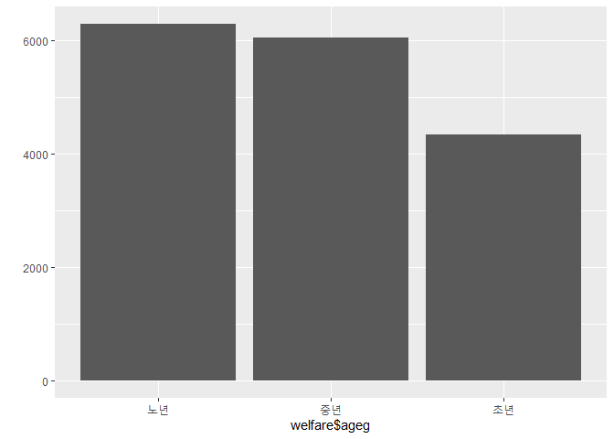
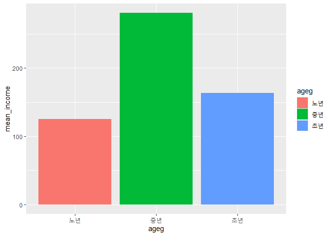
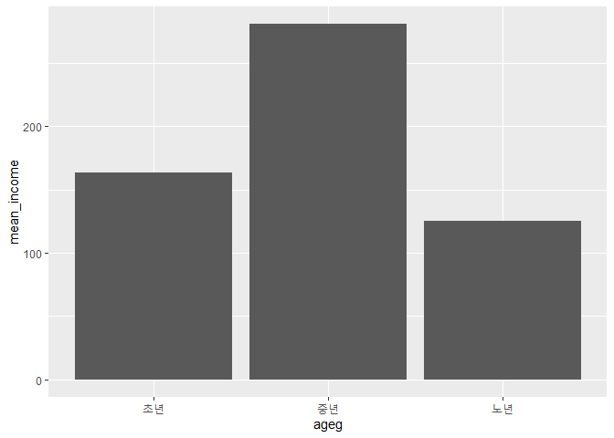

어떤 연령 대의 월급이 가장 많을까?
================
작성자
July 30, 2020

## 4\. 연령대에 따른 월급 차이

### 분석 절차

### 연령대 변수 검토 및 전처리하기

#### 1\. 파생변수 만들기 - 연령대

앞에서 만든 나이 변수를 이용해 아래 표 기준에 맞춘 연령대 변수를 만들겠습니다.

| 범주 |   기준    |
| :-: | :-----: |
| 초년 | 30세 미만  |
| 중년 | 30\~59세 |
| 노년 | 60세 이상  |

조건에 맞춘 변수를 생성하기 위해서는 `mutate()`와 `ifelse()`를 사용하겠습니다.

``` r
welfare <- welfare %>% 
  mutate(ageg = ifelse(age < 30,"초년",
                       ifelse(age >= 60,"노년","중년")))
table(welfare$ageg)
```

    ## 
    ## 노년 중년 초년 
    ## 6281 6049 4334

역시 숫자보다는 그림이 더 편하겠죠? 간단하게 `qplot`를 사용하겠습니다.

``` r
qplot(welfare$ageg)
```

<!-- -->

### 연령대에 따른 월급 차이 분석하기

#### 1\. 연령대별 월급 평균표 만들기

연령대별 월급 평균표를 만들기 위해서는 먼저 월급 데이터를 추출하고`(filter)`, 연령대의 그룹을
분리하여`(group)`요약 통계량을 사용합니다.`(summarise)`

``` r
ageg_income <- welfare %>%  
  filter(!is.na(income)) %>%  # 결측치를 제외한 월급 데이터 추출 
  group_by(ageg) %>%          # 연령대 별로 그룹 분리 
  summarise(mean_income = mean(income)) # 월급 평균 요약 산출
```

    ## `summarise()` ungrouping output (override with `.groups` argument)

``` r
ageg_income
```

    ## # A tibble: 3 x 2
    ##   ageg  mean_income
    ##   <chr>       <dbl>
    ## 1 노년         125.
    ## 2 중년         281.
    ## 3 초년         164.

월급 평균은 초년생이 163만원, 중년 280만원, 노년은 125만원임을 알 수 있습니다.

#### 2\. 그래프 만들기

앞에서 만든 표를 이용하여 그래프를 그리겠습니다. 그래프는 `ggplot`를 이용하겠습니다. 앞에서는 qplot를 사용했는데요.
qplot는 문법이 간단해서 주로 전처리(데이터 가공)단계에서 데이터를 빠르게 보는 용도로 사용하고 최종 결과물은 ggplot를
사용하여 다양한 그래프를 그립니다.

``` r
ggplot(data=ageg_income, aes(x=ageg,y=mean_income,fill=ageg)) + geom_col()
```

<!-- -->

막대가 연령대에 따라 다른 색으로 표현되게 하려면 `fill()`에 연령대 함수를 지정합니다.

#### 막대 정렬 : 초년, 중년, 노년 나이 순

훨씬 보기가 쉬워졌지만 초년 부터 노년까지 보는 것이 좋을 것 같아요 기본 적으로 ggplot는 알파벳, 자음 순서대로 정렬하도록
기본 값이 설정되어 있습니다. 막대의 범주 순서를 정하는 것은 `scale_x_discrete(limits=c())`를 추가하면
됩니다.

``` r
ggplot(data=ageg_income, aes(ageg,mean_income)) + geom_col() +
  scale_x_discrete(limits=c("초년","중년","노년"))
```

<!-- -->

**자, 표와 그래프를 보면 중년이 280만원 정도로 가장 많은 월급을 받고 노년이 초년보다 약 40만원 정도 적은 월급을 받는
것을 알 수 있습니다.**
