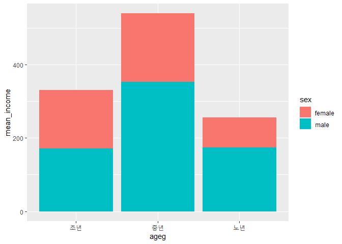
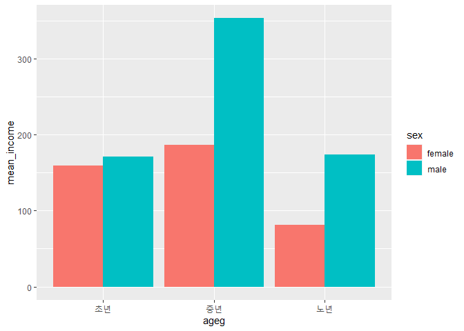

성별 월급 차이는 연령대별로 다를까
================
작성자
July 31, 2020

## 5\. 연령대 및 성별 월급 차이

성별 월급 차이가 연령대에 따라 다른지 분석해보겠습니다.앞에서 연령대, 성별, 월급 변수 모두 전처리를 완료하였기에 바로 관계를
분석하겠습니다.

### 분석 절차

### 연령대 및 성별 월급 차이 분석하기

#### 1\. 연령대 및 성별 월급 평균표 만들기

먼저 월급 데이터를 추출하고`(filter)`, 연령대와 성별의 그룹을 분리하고 `(group_by)`, 요약통계량을
산출`(summarise)`합니다.

``` r
sex_income <- welfare %>% 
  filter(!is.na(income)) %>%  # 결측치를 제외한 월급 데이터 추출 
  group_by(ageg,sex) %>%      # 성별과 연령대로 그룹 분리 
  summarise(mean_income = mean(income)) # 월급 평균 요약 통계량 산출 
```

    ## `summarise()` regrouping output by 'ageg' (override with `.groups` argument)

``` r
sex_income
```

    ## # A tibble: 6 x 3
    ## # Groups:   ageg [3]
    ##   ageg  sex    mean_income
    ##   <chr> <chr>        <dbl>
    ## 1 노년  female        81.5
    ## 2 노년  male         174. 
    ## 3 중년  female       186. 
    ## 4 중년  male         353. 
    ## 5 초년  female       160. 
    ## 6 초년  male         171.

#### 2\. 그래프 만들기

#### 성별 막대 분리

x축에 연령대, y 축에 월급 평균으로 지정합니다.

``` r
ggplot(data=sex_income, aes(x=ageg,y=mean_income,fill=sex)) + # x축에 연령대, y축에 월급 평균을 지정하고, 막대 색상은 성별로 다르게 설정하기
  geom_col() + # 막대 그래프 그리기 
  scale_x_discrete(limits=c("초년","중년","노년")) # 초년, 중년, 노년 순서대로 그리기 
```

<!-- -->

자, 이번엔 성별의 월급이 연령대 막대에 함께 표현 되어 있어 차이 비교가 어렵기 때문에 분리하는 작업을 하도록 하겠습니다.
`geom_col()`의 `position`파라미터를 `dodge`로 설정해 막대를 분리하겠습니다. position은 막대의
위치를 의미합니다. dodge는 복수의 데이터를 독립적인 막대 그래프로 나란히 표현할 때 사용합니다.

``` r
ggplot(data=sex_income, aes(x=ageg,y=mean_income,fill=sex)) + # x축에 연령대, y축에 월급 평균을 지정하고, 막대 색상은 성별로 다르게 설정하기
  geom_col(position = "dodge") + # 막대 그래프를 성별을 분리해서 그리기 
  scale_x_discrete(limits=c("초년","중년","노년")) # 초년, 중년, 노년 순서대로 그리기 
```

<!-- -->

**출력 결과를 보면 초년생일 때는 여자와 남자의 월급이 큰 차이가 나타나지 않지만 중년부터는 차이가 크게 벌어집니다. 여성은
초년과 중년에서 큰 차이가 나타나지 않지만 남성은 초년과 노년의 월급이 큰 차이가 나타나지 않습니다.**

### 나이 및 성별 월급 차이 분석하기

이번에는 연령대로 구분하지 않고 나이 및 성별 월급 평균표를 만들어보겠습니다.

먼저 월급 데이터를 추출하고`(filter)`, 나이와 성별의 그룹을 분리하고 `(group_by)`, 요약통계량을
산출`(summarise)`합니다.

``` r
age_sex <- welfare %>% 
  filter(!is.na(income)) %>%  # 결측치를 제외한 월급 데이터 추출 
  group_by(age,sex) %>%      # 성별과 나이로 그룹 분리 
  summarise(mean_income = mean(income)) # 월급 평균 요약 통계량 산출 
```

    ## `summarise()` regrouping output by 'age' (override with `.groups` argument)

``` r
age_sex
```

    ## # A tibble: 134 x 3
    ## # Groups:   age [69]
    ##      age sex    mean_income
    ##    <dbl> <chr>        <dbl>
    ##  1    20 female        147.
    ##  2    20 male           69 
    ##  3    21 female        107.
    ##  4    21 male          102.
    ##  5    22 female        140.
    ##  6    22 male          118.
    ##  7    23 female        139.
    ##  8    23 male          153.
    ##  9    24 female        126.
    ## 10    24 male          158.
    ## # ... with 124 more rows

#### 그래프 만들기

이번에는 x축을 나이, y축을 월급 평균으로 지정해서 그래프를 선 그래프로 그리고`(geom_line)` 월급 평균 선이 성별에
따라 다른 색상으로 표현되도록 aes()의 `col`파라미터에 성별을 지정하겠습니다.

``` r
ggplot(data=age_sex, aes(x=age,y=mean_income,col=sex)) + geom_line()
```

<!-- -->

**출력 결과를 보면 남성은 50세까지 증가하다가 급격하게 감소하는 반면 여성은 30세전후까지 약간 상승하다가 그 이후로 완만하게
감소하는 것을 알 수 있습니다. 성별 격차는 30대까지 비슷하게 월급이 상승하다가 30세 이후부터 급격하게 차이를 보이며 70대가
되면 비슷한 수준이 되는 것을 알 수 있습니다.**
