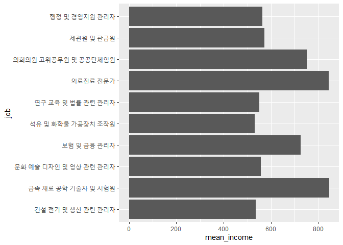
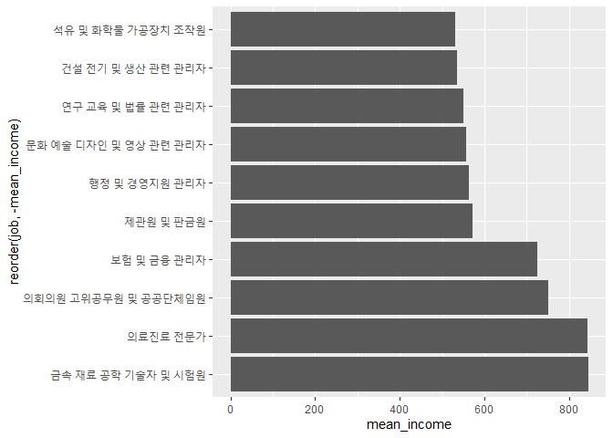
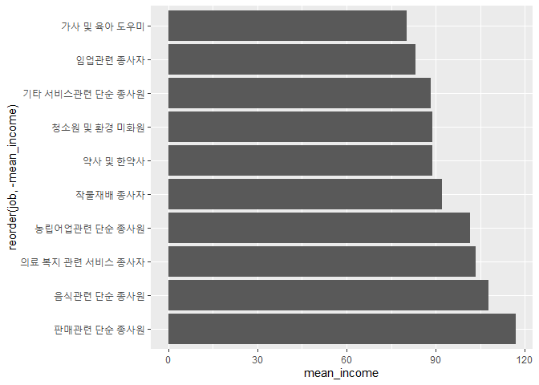

어떤 직업이 월급을 가장 많이 받을까
================
작성자
July 31, 2020

## 6\. 직업별 월급 차이

### 분석 절차

### 직업 변수 검토 및 전처리하기

#### 1\. 변수 검토하기

  - 직업 변수를 검토하기 위해 변수의 타입`(class)`을 확인하겠습니다.

<!-- end list -->

``` r
class(welfare$code_job)
```

    ## [1] "numeric"

  - 다른 변수와 달리 직업 변수는 직업 코드를 의미하는 것이기 때문에 빈도표로 데이터를 파악하겠습니다. `(table)`

<!-- end list -->

``` r
table(welfare$code_job)
```

    ## 
    ##  111  120  131  132  133  134  135  139  141  149  151  152  153  159  211  212 
    ##    2   16   10   11    9    3    7   10   35   20   26   18   15   16    8    4 
    ##  213  221  222  223  224  231  232  233  234  235  236  237  239  241  242  243 
    ##    3   17   31   12    4   41    5    3    6   48   14    2   29   12    4   63 
    ##  244  245  246  247  248  251  252  253  254  259  261  271  272  273  274  281 
    ##    4   33   59   77   38   14  111   24   67  109    4   15   11    4   36   17 
    ##  283  284  285  286  289  311  312  313  314  320  330  391  392  399  411  412 
    ##    8   10   26   16    5  140  260  220   84   75   15    4   13   87   47   12 
    ##  421  422  423  429  431  432  441  442  510  521  522  530  611  612  613  620 
    ##  124   71    5   14   20   33  154  197  192  353    5  106 1320   11   40    2 
    ##  630  710  721  722  730  741  742  743  751  752  753  761  762  771  772  773 
    ##   20   29   30   22   16   27    3   34   34    5   49   69   27   11   61   86 
    ##  774  780  791  792  799  811  812  819  821  822  823  831  832  841  842  843 
    ##    7   17    5   21   45   16    1    6    9    9   23    5   17   32   10    4 
    ##  851  852  853  854  855  861  862  863  864  871  873  874  875  876  881  882 
    ##   19   13    7   33    9    3   14   17   31    2  257   34   37    2    2    3 
    ##  891  892  899  910  921  922  930  941  942  951  952  953  991  992  999 1011 
    ##    8   19   16  102   31   74  289  325   99  125  122   73   45   12  141    2 
    ## 1012 
    ##   17

직업 코드가 숫자로 구성되어 있어 분석을 하더라도 코드가 어떤 직업을 나타내는지 알 수 없습니다. 따라서 직업 분류 코드를 이용해
직업 명칭 변수를 생성해야 합니다.

#### 2\. 전처리

먼저 직업 분류 코드를 다운로드하여 프로젝트 폴더에 삽입한 후 불러오도록 하겠습니다. 엑셀 파일을 불러오기 위해서는
`readxl`패키지가 필요합니다.

직업 분류 코드는 코드북 Sheet 2번째에 있기 때문에 `sheet 파라미터`를 설정해주어야 하고, 첫 행을 변수명으로
가져오도록 `col_names=T`를 설정합니다. 하지만 작업 분류 코드의 첫 행이 변수이기 때문에 별도로
`col_names`를 설정하지 않겠습니다. 데이터 첫 행 부터 데이터인 경우에는 반드시 col\_names 파라미터를 사용하여
데이터를 유실하지 않도록 합니다.

``` r
list_job <- read_excel("Koweps_Codebook.xlsx", sheet = 2)

head(list_job)
```

    ## # A tibble: 6 x 2
    ##   code_job job                                
    ##      <dbl> <chr>                              
    ## 1      111 의회의원 고위공무원 및 공공단체임원
    ## 2      112 기업고위임원                       
    ## 3      120 행정 및 경영지원 관리자            
    ## 4      131 연구 교육 및 법률 관련 관리자      
    ## 5      132 보험 및 금융 관리자                
    ## 6      133 보건 및 사회복지 관련 관리자

직업이 몇 개까지 분류 되는지 확인하기 위해서는 행과 열의 숫자를 확인할 수 있는 `dim()`을 사용합니다.

``` r
dim(list_job)
```

    ## [1] 149   2

직업이 149개까지 분류된다는 것을 확인하였습니다. 이 분류 표를 기존 데이터에 합쳐 코드에 따라 어떤 직업인지 바로 확인할 수
있도록 하겠습니다. 변수인 열을 합치는 형태이기 때문에 `left_join()`을 사용하겠습니다.

``` r
welfare <- left_join(welfare,list_job, by="code_job")
```

제대로 결합이 완료되었는지 일부 출력해보겠습니다.

``` r
welfare %>% 
  filter(!is.na(code_job)) %>% # 직업 코드 변수의 결측치를 제외한 데이터만 추출 
  select(code_job,job) %>% # 직업 코드 변수와 직업 분류 변수만 추출  
  head(10) # 앞 부분부터 10행까지 출력
```

    ##    code_job                                job
    ## 1       942                   경비원 및 검표원
    ## 2       762                             전기공
    ## 3       530 방문 노점 및 통신 판매 관련 종사자
    ## 4       999        기타 서비스관련 단순 종사원
    ## 5       312                    경영관련 사무원
    ## 6       254             문리 기술 및 예능 강사
    ## 7       510                        영업 종사자
    ## 8       530 방문 노점 및 통신 판매 관련 종사자
    ## 9       286   스포츠 및 레크레이션 관련 전문가
    ## 10      521                   매장 판매 종사자

### 직업별 월급 차이 분석하기

#### 1\. 직업별 월급 평균표 만들기

먼저 월급 데이터를 추출하고`(filter)`, 직업별 그룹을 분리하고 `(group_by)`, 요약통계량을
산출`(summarise)`합니다.

``` r
job_income <- welfare %>% 
  filter(!is.na(income)) %>% # 결측치를 제외한 월급 데이터 추출 
  group_by(job) %>%          # 직업 별로 분리 
  summarise(mean_income = mean(income)) # 월급 평균 요약 통계량 산출
```

    ## `summarise()` ungrouping output (override with `.groups` argument)

``` r
job_income
```

    ## # A tibble: 142 x 2
    ##    job                                mean_income
    ##    <chr>                                    <dbl>
    ##  1 가사 및 육아 도우미                       80.2
    ##  2 간호사                                   241. 
    ##  3 건설 및 광업 단순 종사원                 190. 
    ##  4 건설 및 채굴 기계운전원                  358. 
    ##  5 건설 전기 및 생산 관련 관리자            536. 
    ##  6 건설관련 기능 종사자                     247. 
    ##  7 건설구조관련 기능 종사자                 242. 
    ##  8 건축 및 토목 공학 기술자 및 시험원       378. 
    ##  9 건축마감관련 기능 종사자                 254. 
    ## 10 경비원 및 검표원                         134. 
    ## # ... with 132 more rows

#### 2\. 상위 10개 추출

어떤 직업의 월급이 많은지 확인하기 위해서 내림차순 `arrange(desc())`을 이용하여 설정하겠습니다.

``` r
top10 <- job_income %>% 
  arrange(desc(mean_income)) %>% 
  head(10)

top10
```

    ## # A tibble: 10 x 2
    ##    job                                  mean_income
    ##    <chr>                                      <dbl>
    ##  1 금속 재료 공학 기술자 및 시험원             845.
    ##  2 의료진료 전문가                             844.
    ##  3 의회의원 고위공무원 및 공공단체임원         750 
    ##  4 보험 및 금융 관리자                         726.
    ##  5 제관원 및 판금원                            572.
    ##  6 행정 및 경영지원 관리자                     564.
    ##  7 문화 예술 디자인 및 영상 관련 관리자        557.
    ##  8 연구 교육 및 법률 관련 관리자               550.
    ##  9 건설 전기 및 생산 관련 관리자               536.
    ## 10 석유 및 화학물 가공장치 조작원              532.

#### 3\. 그래프 만들기

x축은 직업명, y축은 월급 평균을 지정하여 막대그래프를 그리려고 합니다. 다만, 직업 이름이 길기 때문에 x축이 서로 겹쳐
알아볼 수 없습니다. `coord_flip()`를 추가하여 막대를 오른쪽으로 90도 회전하겠습니다.

``` r
ggplot(data=top10, aes(x=job,y=mean_income)) +
  geom_col()+
  coord_flip()
```

<!-- -->

보기가 편하도록 크기 순으로 정렬하겠습니다. `reorder`을 사용하겠습니다. reorder()에 x축 변수와 정렬 기준으로
삼을 변수를 지정하면 됩니다. 정렬 기준 변수 앞에 -기호를 붙이면 내림차순으로 정렬합니다. 단, 변수의 값이 숫자와
문자로 함께 구성되면 숫자 오름차순, 알파벳 오름차순으로 정렬됩니다.

``` r
ggplot(data=top10, aes(x=reorder(job,-mean_income),y=mean_income)) +
  geom_col() +
  coord_flip()
```

<!-- -->

**출력 결과를 보면 ’금속 재료 공학 기술자 및 시험원’이 가장 많은 월급을 받고 의료진료 전문가, 의회의원 고위 공무원 및
공공 단체 임원 순으로 월급을 많이 받는 다는 것을 알 수 있습니다.**

#### 4\. 하위 10위 추출

어떤 직업의 월급이 적은지 확인하기 위해서 오름 차순인 `arrange()`을 이용하여 설정하겠습니다.

``` r
bottom10 <- job_income %>% 
  arrange(mean_income) %>% 
  head(10)

bottom10
```

    ## # A tibble: 10 x 2
    ##    job                          mean_income
    ##    <chr>                              <dbl>
    ##  1 가사 및 육아 도우미                 80.2
    ##  2 임업관련 종사자                     83.3
    ##  3 기타 서비스관련 단순 종사원         88.2
    ##  4 청소원 및 환경 미화원               88.8
    ##  5 약사 및 한약사                      89  
    ##  6 작물재배 종사자                     92  
    ##  7 농립어업관련 단순 종사원           102. 
    ##  8 의료 복지 관련 서비스 종사자       104. 
    ##  9 음식관련 단순 종사원               108. 
    ## 10 판매관련 단순 종사원               117.

#### 5\. 그래프 만들기

앞서 그린 것과 동일하게 그래프를 그려보겠습니다.

``` r
ggplot(data=bottom10, aes(x=reorder(job,-mean_income),y=mean_income)) +
  geom_col() +
  coord_flip()
```

<!-- -->

가사 및 육아 도우미가 가장 월급이 낮다는 것을 알 수 있습니다. 이번엔 그래프를 앞에서 마든 상위 10위 그래프와 비교할 수
있도록 y축을 가장 많은 월급인 850까지 표현되게 `ylim`을 설정하겠습니다.

``` r
ggplot(data=bottom10, aes(x=reorder(job,-mean_income),y=mean_income)) +
  geom_col() +
  coord_flip() +
  ylim(0,850)
```

<!-- -->

**출력 결과를 보면 가장 많은 월ㄹ급을 받는 금속 재료 공학 기술자 및 시험원이 가사 및 육아 도우미의 열배가 넘는 월급을 받는
다는 것을 알 수 있습니다.**
