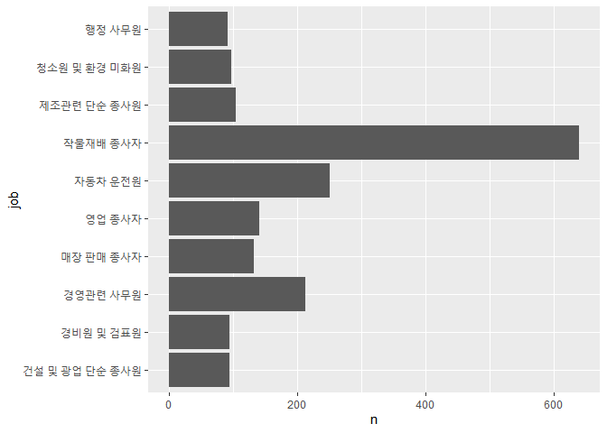
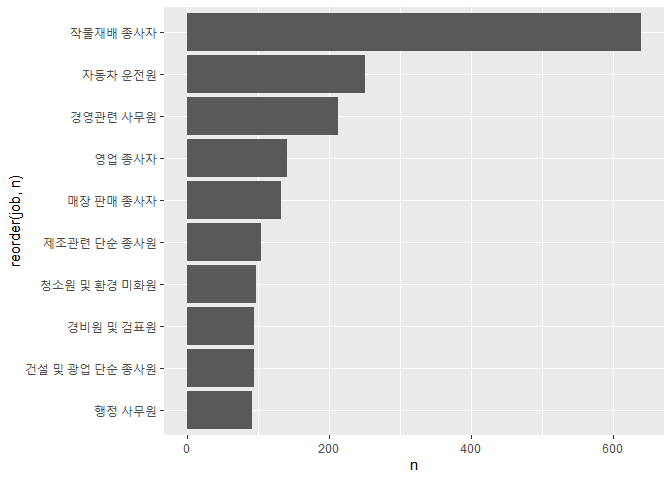
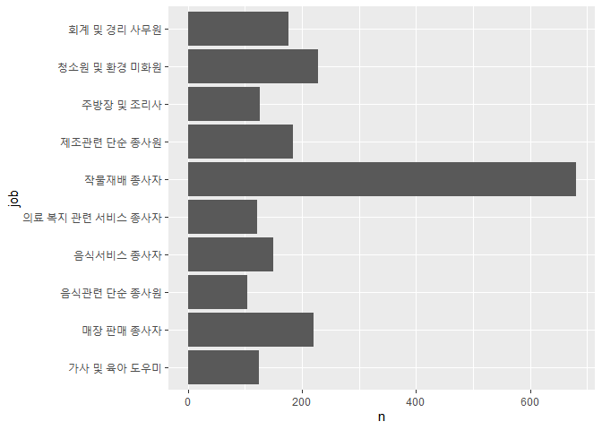
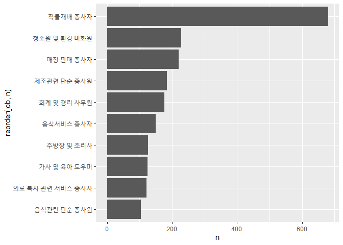

성별로 어떤 직업이 가장 많을까?
================
작성자
July 30, 2020

## 7\. 성별 직업 빈도

### 분석 절차

성별 변수와 직업 변수는 앞서 검토 및 전처리를 완료하여 생략하고 변수의 관계를 파악하도록 하겠습니다.

### 성별 직업 빈도 분석하기

#### 1\. 성별 직업 빈도표 만들기

각 성별로 직업별 빈도를 구해 상위 10개를 추출하겠습니다.

  - *남성 직업 빈도 상위 10개 추출*

<!-- end list -->

``` r
job_male <- welfare %>% 
  filter(!is.na(job) & sex=="male") %>% #job 변수에서 결측치를 제외, sex 변수에서 남성만 추출 
  group_by(job) %>% # 직업별로 분리 
  summarise(n=n()) %>% # 남성 직업의 개수 통계량 산출 
  arrange(desc(n)) %>% # 내림차순으로 정렬하여 상위 개수 파악
  head(10) #10개만 출력

job_male
```

    ## # A tibble: 10 x 2
    ##    job                          n
    ##    <chr>                    <int>
    ##  1 작물재배 종사자            640
    ##  2 자동차 운전원              251
    ##  3 경영관련 사무원            213
    ##  4 영업 종사자                141
    ##  5 매장 판매 종사자           132
    ##  6 제조관련 단순 종사원       104
    ##  7 청소원 및 환경 미화원       97
    ##  8 건설 및 광업 단순 종사원    95
    ##  9 경비원 및 검표원            95
    ## 10 행정 사무원                 92

  - *여성 직업 빈도 상위 10개 추출*

<!-- end list -->

``` r
job_female <- welfare %>% 
  filter(!is.na(job) & sex=="female") %>% #job 변수에서 결측치를 제외, sex 변수에서 여성만 추출 
  group_by(job) %>% # 직업별로 분리 
  summarise(n=n()) %>% # 남성 직업의 개수 통계량 산출 
  arrange(desc(n)) %>% # 내림차순으로 정렬하여 상위 개수 파악
  head(10) #10개만 출력

job_female
```

    ## # A tibble: 10 x 2
    ##    job                              n
    ##    <chr>                        <int>
    ##  1 작물재배 종사자                680
    ##  2 청소원 및 환경 미화원          228
    ##  3 매장 판매 종사자               221
    ##  4 제조관련 단순 종사원           185
    ##  5 회계 및 경리 사무원            176
    ##  6 음식서비스 종사자              149
    ##  7 주방장 및 조리사               126
    ##  8 가사 및 육아 도우미            125
    ##  9 의료 복지 관련 서비스 종사자   121
    ## 10 음식관련 단순 종사원           104

#### 2\. 그래프 만들기

앞에서 만든 성별 직업 빈도표를 이용해 그래프를 만들겠습니다. 요약표를 만든 후 그래프를 그리는 것이기 때문에
`geom_col()`을 사용합니다. 이때 직업 이름이 길기 때문에 `coord_flip()`를 사용해 오른쪽으로 90도 회전
시켜 겹치지 않도록 합니다.

  - *남성 직업 빈도 상위 10개 직업*

<!-- end list -->

``` r
ggplot(data=job_male, aes(job,n)) + geom_col()+ coord_flip()
```

<!-- -->

이번에는 보기 편하도록 크기 순으로 정렬하도록 하겠습니다. 내림차순 정렬은 `reorder()`를 사용합니다.

``` r
ggplot(data=job_male, aes(x=reorder(job,n),y=n)) + geom_col()+ coord_flip()
```

<!-- -->

  - *여성 직업 빈도 상위 10개 직업*

<!-- end list -->

``` r
ggplot(data=job_female, aes(job,n)) + geom_col()+ coord_flip()
```

<!-- -->

남성 막대 그래프와 같이 보기 편하도록 크기 순으로 정렬하도록 하겠습니다. 내림차순 정렬은 `reorder()`를 사용합니다.

``` r
ggplot(data=job_female, aes(x=reorder(job,n),y=n)) + geom_col()+ coord_flip()
```

<!-- -->

**출력 결과를 보면 남성들이 가장 많이 가지고 있는 직업은 작물 재배 종사자, 자동차 운전원, 경영관련 사무원, 영업 종사자라는
것을 알 수 있습니다. 여성들은 작물 재배종사자, 청소원 및 환경 미화원, 매장 판매 종사자, 제조 관련 단순 종사원이라는 것을
알 수 있습니다.**
