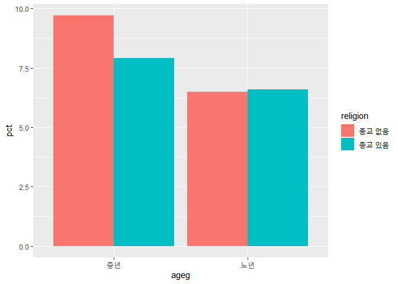

종교가 있는 사람들이 이혼을 덜할까?
================
작성자
July 30, 2020

## 8\. 종교 유무에 따른 이혼율

### 분석 절차

### 종교 변수 검토 및 전처리하기

#### 1\. 변수 검토하기

변수 검토는 `class()`를 사용하여 변수의 속성을 파악하고, 이에 맞추어 `table()` 또는 `summarise()`를
사용합니다. 종교 변수는 범주 변수이기 때문에 `table()`를 사용합니다.

``` r
class(welfare$religion)
```

    ## [1] "numeric"

``` r
table(welfare$religion)
```

    ## 
    ##    1    2 
    ## 8047 8617

출력 결과를 보면 1과 2 외에 다른 값이 존재하지 않아 이상치 결측 작업은 제외하겠습니다.

#### 2\. 전처리

이상치가 없었으나, 변수의 값을 직관적으로 확인할 수 있도록 값의 의미를 부여하도록 하겠습니다. 조건문 함수인
`ifelse()`를 사용하면 됩니다.

``` r
welfare$religion <- ifelse(welfare$religion == 1, "종교 있음","종교 없음") # 종교 여부 이름 부여 

table(welfare$religion) #종교 여부 이름 부여 되었는지 확인하기 
```

    ## 
    ## 종교 없음 종교 있음 
    ##      8617      8047

종교가 있는 사람은 8047명, 없는 사람은 8616명입니다. 숫자가 아닌 표로도 그려보겠습니다. 전처리 단계에서는
`qplot()`로 간단하게 그래프를 출력합니다.

``` r
qplot(welfare$religion)
```

<!-- -->

### 혼인 상태 변수 검토 및 전처리하기

#### 1\. 변수 검토하기

앞서 검토한 종교 변수와 동일한 절차로 진행합니다.

``` r
class(welfare$marriage)
```

    ## [1] "numeric"

``` r
table(welfare$marriage)
```

    ## 
    ##    0    1    2    3    4    5    6 
    ## 2861 8431 2117  712   84 2433   26

코드 북에는 별도로 이상치나 극단치가 기재되어 있지 않아 해당 절차를 생략하겠습니다.

#### 2\. 전처리

우리는 이혼여부에 대해서 확인이 필요합니다. 그렇다면 결혼과 이혼 두개의 내용만 알면 되는데요. 현재 혼인 상태 변수에는
0\~6까지 반영되어 있습니다. 그 중, 배우자가 있을 경우 1 과 이혼했을 경우 3을 이용해 이혼 여부를 나타내는 변수를
만들겠습니다.

``` r
welfare$group_marriage <- ifelse(welfare$marriage == 1, "결혼",
                                 ifelse(welfare$marriage==3, "이혼", NA))
```

해당 코드가 잘 반영 되어 있는지 각각 확인해보겠습니다.

``` r
table(welfare$group_marriage) # 이혼 여부 확인 
```

    ## 
    ## 결혼 이혼 
    ## 8431  712

``` r
table(is.na(welfare$group_marriage)) # 결측값 확인
```

    ## 
    ## FALSE  TRUE 
    ##  9143  7521

``` r
qplot(welfare$group_marriage)
```

<!-- -->

**출력 결과를 보면 결혼 상태인 사람은 8431명, 이혼한 사람은 712명이라는 것을 알 수 있습니다. 줄 중 어디에도 속하지
않을 경우 NA 처리 하였으며, 이 값은 이후 `!is.na()`를 이용하여 분석에서 제외하여 진행하겠습니다.**

### 종교 유무에 따른 이혼율 분석하기

#### 1\. 종교 유무에 따른 이혼율 표 만들기

먼저 종교 유무 및 결혼 상태별로 나눠 빈도를 구한 뒤, 각 종교 유무 집단의 전체 빈도로 나눠 비율을 구합니다. 이때, 비율은
`round()`를 이용하여 소수점 첫째자리까지 표현되도록 합니다.

``` r
religion_marriage <- welfare %>% 
  filter (!is.na(group_marriage)) %>% # 결혼 상태 변수의 결측치 값을 제외한 행을 추출 
  group_by(religion, group_marriage) %>% # 종교 변수와 결혼 상태 변수의 값을 분리합니다. 
  summarise(n=n()) %>% # 각 집단 별 빈도를 구합니다. 
  mutate(tot_group = sum(n)) %>% # 각 집단의 합을 구합니다. 
  mutate(pct = round(n/sum(n)*100,1)) # 결혼, 이혼율 구하기 
```

    ## `summarise()` regrouping output by 'religion' (override with `.groups` argument)

``` r
religion_marriage
```

    ## # A tibble: 4 x 5
    ## # Groups:   religion [2]
    ##   religion  group_marriage     n tot_group   pct
    ##   <chr>     <chr>          <int>     <int> <dbl>
    ## 1 종교 없음 결혼            4218      4602  91.7
    ## 2 종교 없음 이혼             384      4602   8.3
    ## 3 종교 있음 결혼            4213      4541  92.8
    ## 4 종교 있음 이혼             328      4541   7.2

#### `count()` 활용

dplyr의 `count()`는 집단별 빈도를 구하는 함수입니다. 해당 함수를 사용하지 않을 경우에는 `gorup_by`와
`summarise의 n을 이용`하여 빈도를 구해야 합니다.

``` r
religion_marriage <- welfare %>% 
  filter (!is.na(group_marriage)) %>% # 결혼 상태 변수의 결측치 값을 제외한 행을 추출 
  count(religion, group_marriage) %>% # 종교 변수와, 결혼 상태 변수별 빈도 구하기 
  group_by(religion) %>% # 종교 상태 그룹 분리 
  mutate(pct = round(n/sum(n)*100,1)) # 결혼, 이혼율 구하기 

religion_marriage
```

    ## # A tibble: 4 x 4
    ## # Groups:   religion [2]
    ##   religion  group_marriage     n   pct
    ##   <chr>     <chr>          <int> <dbl>
    ## 1 종교 없음 결혼            4218  91.7
    ## 2 종교 없음 이혼             384   8.3
    ## 3 종교 있음 결혼            4213  92.8
    ## 4 종교 있음 이혼             328   7.2

#### 2\. 이혼율 표 만들기

앞에서 만든 표에서 이혼에 해당하는 값만 추출해 이혼율 표를 만들겠습니다.

``` r
divorce <- religion_marriage %>% 
  filter(group_marriage == "이혼") %>% # 결혼 상태 변수의 이혼 행만 추출  
  select(religion, pct) # 변수 지역과 이혼율 추출 

divorce
```

    ## # A tibble: 2 x 2
    ## # Groups:   religion [2]
    ##   religion    pct
    ##   <chr>     <dbl>
    ## 1 종교 없음   8.3
    ## 2 종교 있음   7.2

#### 3\. 그래프 만들기

``` r
ggplot(data=divorce, aes(religion,pct))+geom_col()
```

<!-- -->

**출력 결과를 보면 종교가 있는 경우, 7.2% 종교가 없는 경우 8.3%로 나타났습니다. 따라서 종교가 있는 사람들이 이혼을
덜 한다고 볼 수 있습니다.**

### 연령대 및 종교 유무에 따른 이혼율 분석하기

자 그렇다면 연령대별 이혼율은 어떻게 다른지 추가로 분석해보겠습니다.

#### 1\. 연령대별 이혼율 표 만들기

count()가 아닌 `group_by`와 `summarise`를 이용하겠습니다.

``` r
ageg_marriage <- welfare %>% 
  filter (!is.na(group_marriage)) %>% # 결혼 상태 변수의 결측치 값을 제외한 행을 추출 
  group_by(ageg, group_marriage) %>% # 연령대 변수와 결혼 상태 변수의 값을 분리합니다. 
  summarise(n=n()) %>% # 각 집단 별 빈도를 구합니다. 
  mutate(tot_group = sum(n)) %>% # 각 집단의 합을 구합니다. 
  mutate(pct = round(n/sum(n)*100,1)) # 결혼, 이혼율 구하기 

ageg_marriage
```

    ## # A tibble: 6 x 5
    ## # Groups:   ageg [3]
    ##   ageg  group_marriage     n tot_group   pct
    ##   <chr> <chr>          <int>     <int> <dbl>
    ## 1 노년  결혼            3892      4165  93.4
    ## 2 노년  이혼             273      4165   6.6
    ## 3 중년  결혼            4481      4918  91.1
    ## 4 중년  이혼             437      4918   8.9
    ## 5 초년  결혼              58        60  96.7
    ## 6 초년  이혼               2        60   3.3

#### `count()` 활용

``` r
ageg_marriage <- welfare %>% 
  filter (!is.na(group_marriage)) %>% # 결혼 상태 변수의 결측치 값을 제외한 행을 추출 
  count(ageg, group_marriage) %>% # 연령대 변수와, 결혼 상태 변수별 빈도 구하기 
  group_by(ageg) %>% # 연령대 변수 그룹 분리 
  mutate(pct = round(n/sum(n)*100,1)) # 결혼 및 이혼율 구하기  

ageg_marriage
```

    ## # A tibble: 6 x 4
    ## # Groups:   ageg [3]
    ##   ageg  group_marriage     n   pct
    ##   <chr> <chr>          <int> <dbl>
    ## 1 노년  결혼            3892  93.4
    ## 2 노년  이혼             273   6.6
    ## 3 중년  결혼            4481  91.1
    ## 4 중년  이혼             437   8.9
    ## 5 초년  결혼              58  96.7
    ## 6 초년  이혼               2   3.3

초년의 경우 이혼한 사례가 적다는 것을 알 수 있습니다. 사례가 부족하기 때문에 다른 연령대와 비교는 적합하지 않으므로 분석에서
제외하겠습니다.

``` r
ageg_divorce <- ageg_marriage %>% 
  filter(ageg != "초년" & group_marriage == "이혼") %>% # 연령대 변수에서 초년이 아니면서 결혼 여부 변수에서 이혼인 행을 추출 
  select(ageg,pct) # 연령대 변수와 이혼율만 추출 

ageg_divorce
```

    ## # A tibble: 2 x 2
    ## # Groups:   ageg [2]
    ##   ageg    pct
    ##   <chr> <dbl>
    ## 1 노년    6.6
    ## 2 중년    8.9

#### 2\. 연령대별 이혼율 그래프 만들기

``` r
ggplot(data=ageg_divorce, aes(ageg,pct)) + geom_col()
```

<!-- -->

**출력 결과를 보면 중년의 이혼율은 8.9%, 노년의 이혼율은 6.6라는 것을 알 수 있습니다.**

#### 3\. 연령대 및 종교 유무에 따른 이혼율 표 만들기

앞서 진행한 분석을 토대로 좀 더 세밀하게 생각해보도록 하겠습니다. 종교 유무에 따른 이혼율의 차이가 연령대별로 다른지
알아보겠습니다.

연령대, 종교 유무, 결혼 상태별 비율표를 작성하겠습니다.

``` r
ageg_religion_marriage <- welfare %>% 
  filter (!is.na(group_marriage) & ageg != "초년") %>% # 결혼 상태 변수의 결측치와 연령대 변수에서 초년 값을 제외한 행을 추출 
  group_by(ageg,religion,group_marriage) %>% # 연령대 변수, 종교 변수, 결혼 상태 변수의 값을 분리합니다. 
  summarise(n=n()) %>% # 각 집단 별 빈도를 구합니다. 
  mutate(tot_group = sum(n)) %>% # 각 집단의 합을 구합니다. 
  mutate(pct = round(n/sum(n)*100,1)) # 결혼, 이혼율 구하기 

ageg_religion_marriage
```

    ## # A tibble: 8 x 6
    ## # Groups:   ageg, religion [4]
    ##   ageg  religion  group_marriage     n tot_group   pct
    ##   <chr> <chr>     <chr>          <int>     <int> <dbl>
    ## 1 노년  종교 없음 결혼            1761      1884  93.5
    ## 2 노년  종교 없음 이혼             123      1884   6.5
    ## 3 노년  종교 있음 결혼            2131      2281  93.4
    ## 4 노년  종교 있음 이혼             150      2281   6.6
    ## 5 중년  종교 없음 결혼            2421      2681  90.3
    ## 6 중년  종교 없음 이혼             260      2681   9.7
    ## 7 중년  종교 있음 결혼            2060      2237  92.1
    ## 8 중년  종교 있음 이혼             177      2237   7.9

#### `count()` 활용

count()를 이용하고, 비율을 구하는 mutate()를 하나로 합쳐서 아래와 같은 방식으로도 작성할 수 있습니다.

``` r
ageg_religion_marriage <- welfare %>% 
  filter (!is.na(group_marriage) & ageg != "초년") %>% # 결혼 상태 변수의 결측치와 연령대 변수에서 초년 값을 제외한 행을 추출  
  count(ageg, religion, group_marriage) %>% # 연령대 변수와,종교 변수, 결혼 상태 변수별 빈도 구하기 
  group_by(ageg,religion) %>% # 연령대 변수,종교 변수 그룹 분리 
  mutate(pct = round(n/sum(n)*100,1)) # 결혼 및 이혼율 구하기  

ageg_religion_marriage
```

    ## # A tibble: 8 x 5
    ## # Groups:   ageg, religion [4]
    ##   ageg  religion  group_marriage     n   pct
    ##   <chr> <chr>     <chr>          <int> <dbl>
    ## 1 노년  종교 없음 결혼            1761  93.5
    ## 2 노년  종교 없음 이혼             123   6.5
    ## 3 노년  종교 있음 결혼            2131  93.4
    ## 4 노년  종교 있음 이혼             150   6.6
    ## 5 중년  종교 없음 결혼            2421  90.3
    ## 6 중년  종교 없음 이혼             260   9.7
    ## 7 중년  종교 있음 결혼            2060  92.1
    ## 8 중년  종교 있음 이혼             177   7.9

#### 연령대 및 종교 유무별 이혼율 표 만들기

앞서 결혼 상태별 표를 작성했으니, 이제 진짜 분석의 대상이 되는 이혼율 표를 작성하겠습니다.

``` r
df_divorce <- ageg_religion_marriage%>% 
  filter(group_marriage == "이혼") %>% # 결혼 여부 변수에서 이혼인 행을 추출 
  select(ageg,religion,pct) # 연령대 변수, 종교 변수, 이혼율만 추출 

df_divorce
```

    ## # A tibble: 4 x 3
    ## # Groups:   ageg, religion [4]
    ##   ageg  religion    pct
    ##   <chr> <chr>     <dbl>
    ## 1 노년  종교 없음   6.5
    ## 2 노년  종교 있음   6.6
    ## 3 중년  종교 없음   9.7
    ## 4 중년  종교 있음   7.9

#### 4\. 연령대 및 종교 유무에 따른 이혼율 그래프 만들기

그래프는 `fill()`을 이용하여 종교 유무에 따라 막대 그래프 색상을 다르게 표현해보겠습니다.

``` r
ggplot(data=df_divorce, aes(x= ageg,y= pct, fill=religion)) + geom_col()
```

<!-- -->

종교 유무는 확연하게 보이지만, 연령대 별 차이를 제대로 확인하기가 어렵습니다. 막대를 분리하기 위하여 geom\_col()의
`position`파라미터를 `dodge`로 설정하겠습니다.

``` r
ggplot(data=df_divorce, aes(x= ageg,y= pct, fill=religion)) + geom_col(position = "dodge")
```

<!-- -->

가나다순으로 x축의 개수가 2개 밖에 되지 않아 큰 혼선은 없으나, 연령대 순서대로 기재하는 것이 좋을 듯 합니다.
`scale_x_discrete(limits=())`를 사용하겠습니다.

``` r
ggplot(data=df_divorce, aes(x= ageg,y= pct, fill=religion)) + geom_col(position = "dodge") +
  scale_x_discrete(limits=c("중년","노년"))
```

<!-- -->

**출력 결과를 보면 노년은 종교 유무에 따른 차이가 적고, 중년의 경우 종교 여부에 따라 이혼율이 크게 다르다는 점을 알 수
있습니다. 즉, 중년은 종교가 없는 사람들의 이혼율이 종교가 있는 사람들보다 1.8% 더 높다는 것을 알 수 있습니다.**
