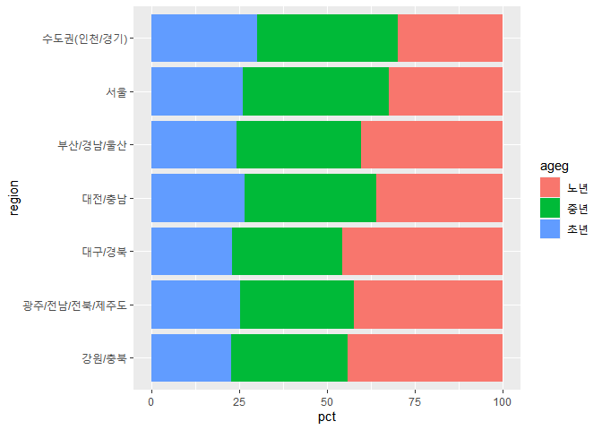
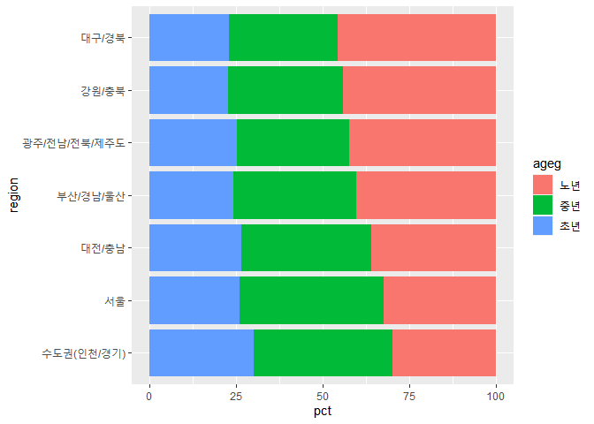

노년층이 많은 지역은 어디일까?
================
작성자
July 30, 2020

## 9\. 지역별 연령대 비율

### 분석 절차

연령대 변수는 이미 앞서 검토 및 전처리를 완료하였기에 생략하고 지역 변수를 진행하겠습니다.

### 지역 변수 검토 및 전처리하기

#### 1\. 변수 검토하기

변수의 검토는 `class()`를 이용하며, 범주 변수이므로 `table()`를 이용하여 이상치를 확인하겠습니다.

``` r
class(welfare$code_region)
```

    ## [1] "numeric"

``` r
table(welfare$code_region)
```

    ## 
    ##    1    2    3    4    5    6    7 
    ## 2486 3711 2785 2036 1467 1257 2922

#### 2\. 전처리

code\_region 변수의 값은 7개 권역을 의미합니다. 지역 코드 목록을 만들어보겠습니다.

``` r
list_region <- data.frame(code_region = c(1:7),
                          region = c("서울",
                                     "수도권(인천/경기)",
                                     "부산/경남/울산",
                                     "대구/경북",
                                     "대전/충남",
                                     "강원/충북",
                                     "광주/전남/전북/제주도"))

list_region
```

    ##   code_region                region
    ## 1           1                  서울
    ## 2           2     수도권(인천/경기)
    ## 3           3        부산/경남/울산
    ## 4           4             대구/경북
    ## 5           5             대전/충남
    ## 6           6             강원/충북
    ## 7           7 광주/전남/전북/제주도

#### welfare에 지역명 변수 추가

변수 추가는 `left_join()`을 이용합니다. left\_join 괄호 안에 `by`파라미터를 이용하여 기준이 되는 변수를
기반으로 열을 추가하는 원리입니다.

``` r
welfare <- left_join(welfare,list_region, by="code_region")
```

잘 반영 되었는지 확인해보겠습니다.

``` r
welfare %>% select(code_region,region) %>% head()
```

    ##   code_region region
    ## 1           1   서울
    ## 2           1   서울
    ## 3           1   서울
    ## 4           1   서울
    ## 5           1   서울
    ## 6           1   서울

### 지역별 연령대 비율 분석하기

#### 1\. 지역별 연령대 비율표 만들기

지역 및 연령대별로 나눠 빈도를 구한 후, 각 지역의 전체 빈도로 나눠 비율을 구합니다.이번에는 소수 둘쩨자리까지 구해보겠습니다.

``` r
region_ageg <- welfare %>% 
  group_by(region, ageg) %>% 
  summarise(n=n()) %>% 
  mutate(tot_group = sum(n)) %>% 
  mutate(pct = round(n/tot_group*100, 2))
```

#### `count()` 활용

좀 더 간편하게 아래와 같은 방식으로 비율 표를 구해보겠습니다.

``` r
region_ageg <- welfare %>% 
  count(region,ageg) %>% 
  group_by(region) %>% 
  mutate(pct= round(n/sum(n)*100, 2))
```

#### 2\. 그래프 만들기

그래프는 `geom_col()`을 이용하고, x축에 지역별, y축에 비율을 지정하고 연령대를 서로 다른 색으로 표현하겠습니다.
이때 지역 이름이 길기 때문에 `coord_flip()`를 추가해 그래프를 오른쪽으로 회전 시킵니다.

``` r
ggplot(data=region_ageg, aes(x=region, y=pct, fill=ageg)) +
  geom_col()+
  coord_flip()
```

<!-- -->

#### 3\. 막대 정렬하기 : 노년층 비율 높은 순

앞에서 만든 그래프는 막대가 밑에서부터 지역며 가나다순으로 정렬되어 있습니다. 이번에는 막대를 노년층 비율이 높은 순으로
정렬하겠습니다.

방법은 노년층 비율 순서대로의 x 축의 값을 지정하는 방법입니다. 그러나 우리는 노년층 내림차순을 알지 못합니다. 그래서
순차적으로 노년층 비율 순으로 정렬한 후, 지역명만 추출해 새로운 변수를 만들고, 이를 기반으로 x축을
조정합니다.

##### 1\) 노년층 비율 내림차순 정렬하기

``` r
list_order_old <- region_ageg %>% 
  filter(ageg == "노년") %>% 
  arrange (pct)
```

##### 2\) 지역명 순서 변수 만들기

``` r
order <- list_order_old$region
order
```

    ## [1] "수도권(인천/경기)"     "서울"                  "대전/충남"            
    ## [4] "부산/경남/울산"        "광주/전남/전북/제주도" "강원/충북"            
    ## [7] "대구/경북"

##### 3\) 노년층 비율 높은 순의 막대 그래프 그리기

``` r
ggplot(data=region_ageg, aes(x=region, y=pct, fill=ageg)) +
  geom_col()+
  coord_flip() +
  scale_x_discrete(limits=order)
```

<!-- -->

**출력 결과를 보면 노년층 비율이 대구/경북이 가장 높고, 수도권(인천/경기)가 제일 낮다는 것을 알 수 있습니다.**
