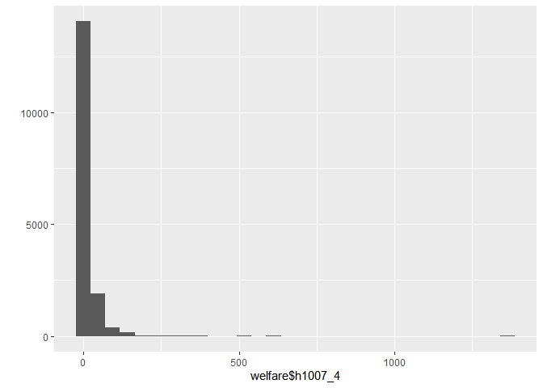
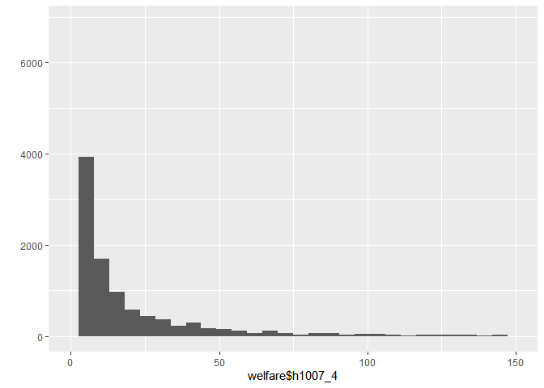
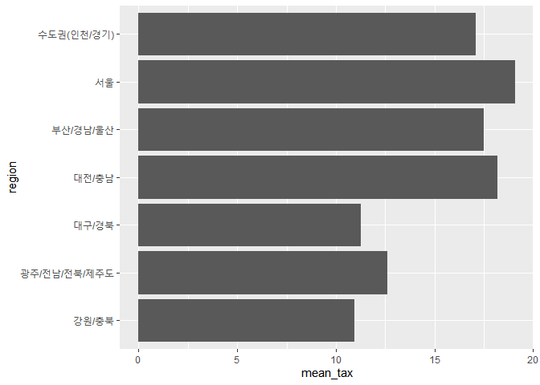
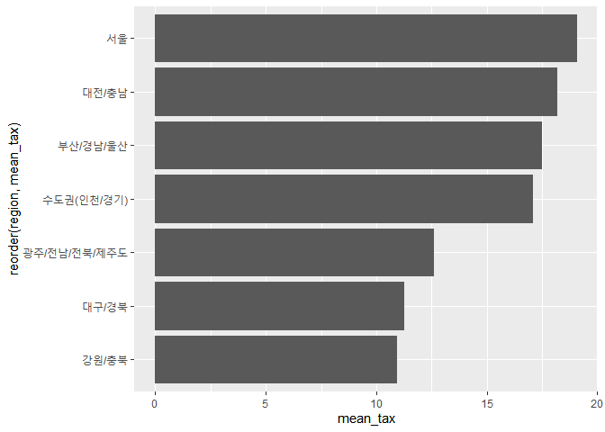

어느 지역에서 세금이 가장 많이 걷힐까?
================
작성자
July 30, 2020

## 10\. 지역에 따른 세금 납부율

시마다, 구마다 걷히는 세금이 달라 정책을 운영하는 예산이 다르기도 합니다. 데이터 분석을 통해 어느 지역의 세금이 가장 많이
걷히는지 알아보겠습니다.

### 분석 절차

지역 변수는 이미 앞서 검토 및 전처리를 완료하여 생략하겠습니다.

### 세금 변수 검토 및 전처리하기

#### 1\. 변수 검토하기

`class()`로 h1007\_4(세금)변수의 타입을 파악하고, 연속 변수이기 때문에 ’summary()’로 특징을
파악하겠습니다.

``` r
class(welfare$h1007_4)
```

    ## [1] "numeric"

``` r
summary(welfare$h1007_4)
```

    ##    Min. 1st Qu.  Median    Mean 3rd Qu.    Max. 
    ##    0.00    0.70    4.00   13.75   12.00 1363.00

h1007\_4는 numeric 타입이고, 0\~1363만 원 사이의 값을 지니며, 7000원 \~13만원 사이에 가장 많이
분포하고 있습니다.평균은 13.75만원, 중앙값은 평균보다 작은 4만원으로 전반적으로 낮은 값 쪽으로 치우쳐져
있습니다.

`qplot()`로 그래프를 그려보겠습니다.

``` r
qplot(welfare$h1007_4)
```

<!-- -->

qplot()는 최댓값까지 표현하도록 기본값이 설정되어 있습니다. 출력된 그래프를 보면 축이 1363까지 있어서 대다수를 차지하는
데이터가 잘 표현되지 않습니다. `xlim()`을 이용하여 150까지만 표현되게 설정하겠습니다.

``` r
qplot(welfare$h1007_4) + xlim(0,150)
```

<!-- -->

#### 2\. 전처리

코드북을 보면 없음은 0, 무응답은 9999로 코딩되어 있다는 것을 알수 있습니다. 이 정보를 바탕으로 전처리 작업을 하겠습니다.
소득이 없어서 세금을 내지 않는 응답자가 있기 때문에 0이 존재합니다. 따라서 결측치는 아니지만, 세금 변수를 사용하기 위해서는
0을 제외하는 것이 편합니다.

##### 이상치 결측 처리

세금의 납부 금액의 차이를 알아볼 것이기 때문에 0과 9999는 결측 처리 하겠습니다.

``` r
welfare$h1007_4 <- ifelse(welfare$h1007_4 %in% c(0,9999),NA,welfare$h1007_4)
```

결측치를 잘 처리했는지 확인해보겠습니다.

``` r
table(is.na(welfare$h1007_4))
```

    ## 
    ## FALSE  TRUE 
    ## 14678  1986

### 지역에 따른 세금 납부 차이 분석하기

#### 1\. 지역 세금 평균표 만들기

``` r
region_tax <- welfare %>% 
  filter(!is.na(h1007_4)) %>% 
  group_by(region) %>% 
  summarise(mean_tax = mean(h1007_4))

region_tax
```

    ## # A tibble: 7 x 2
    ##   region                mean_tax
    ##   <chr>                    <dbl>
    ## 1 강원/충북                 10.9
    ## 2 광주/전남/전북/제주도     12.6
    ## 3 대구/경북                 11.3
    ## 4 대전/충남                 18.2
    ## 5 부산/경남/울산            17.5
    ## 6 서울                      19.1
    ## 7 수도권(인천/경기)         17.1

세금 금액 평균이 서울이 19만원으로 가장 높고, 강원/충북이 10만원으로 가장 낮음을 알 수 있습니다.

#### 2\. 그래프 만들기

분석 결과를 쉽게 이해할 수 있도록 앞에서 만든 지역 세금 평균표를 이용해 막대그래프를 만들겠습니다. x축의 이름이 길기 때문에
그래프를 오른쪽으로 90도 회전하는 `coord_flip`를 사용하겠습니다.

``` r
ggplot(data=region_tax, aes(x=region,y=mean_tax)) +
  geom_col() +
  coord_flip()
```

<!-- -->

막대그래프를 그리면 세금 평균 분포가 좀 더 잘 드러납니다. 하지만 값의 크기대로 되어 있지 않아 `reorder()`을
사용하여수정하겠습니다.

``` r
ggplot(data=region_tax, aes(x=reorder(region,mean_tax),y=mean_tax)) +
  geom_col() +
  coord_flip()
```

<!-- -->

**출력된 그래프를 보면 서울의 세금 납부 금액이 강원/충북의 두배 가까이 될 정도로 많다는 것을 알 수 있습니다.**
